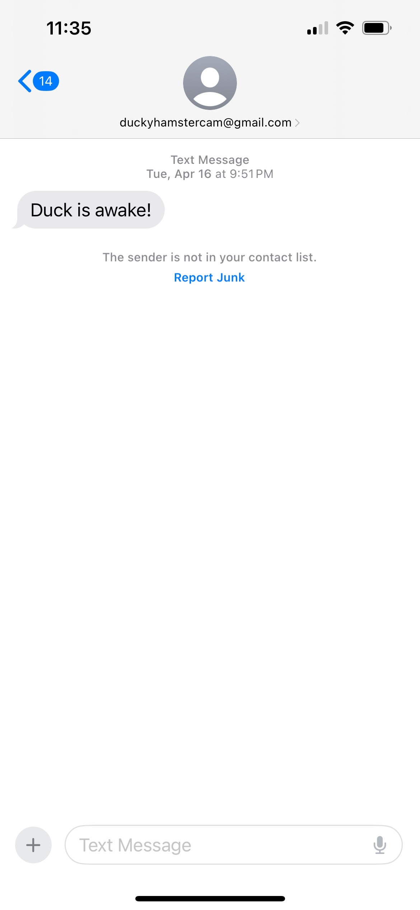

# Hamster Alert

This project leverages a Raspberry Pi and a passive infrared (PIR) sensor to detect when a hamster is awake and active in its cage. When the PIR sensor detects movement, a text message is sent to a specified phone number using the Python SMTP library and Verizon's email-to-SMS service. This project highlights my proficiency in Python and my experience with embedded systems.

- Technologies Used: Raspberry Pi, Python, PIR Sensor, SMTP.
- Description:
    - Movement Detection: Utilized a PIR sensor to monitor the hamster's activity.
    - Notification System: Implemented a Python script to send text alerts via email-to-SMS when movement is detected.
- Skills Demonstrated: Embedded systems, sensor integration, Python programming, real-time notifications.

Example of the text received when our test subject, Duck, is awake.

Setup of the Raspberry Pi and PIR sensor.

This project showcases my ability to integrate hardware and software to create functional and practical solutions.
