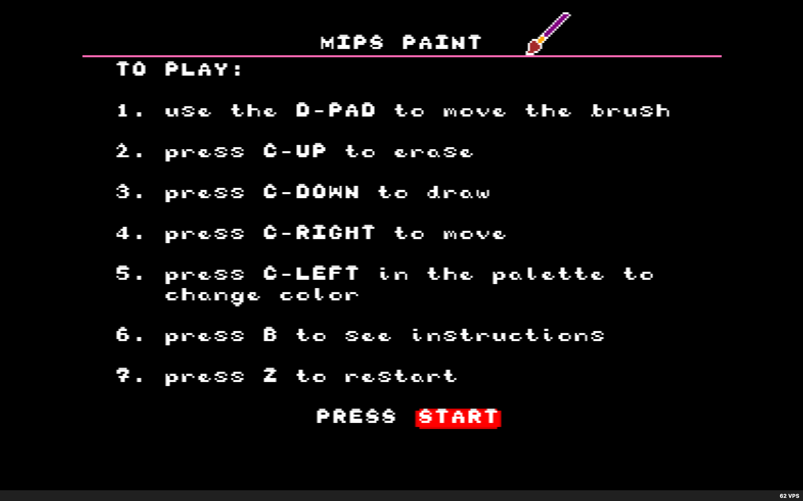
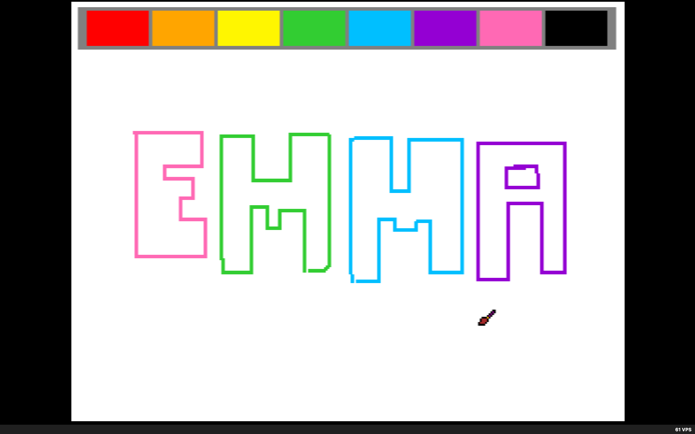

# MIPS Paint

This project is an MS Paint-inspired drawing application designed for the Nintendo 64 gaming console. It features multiple gameplay modes, including drawing, erasing, and moving, along with a color selection tool. The application can be played on a Nintendo 64 console using a programmable cartridge or on retro game emulators like Ares.

The project is implemented in MIPS Assembly, with contributions from PeterLemon's N64 GitHub repository, which provided essential resources and macros used throughout the project. The files in the LIB folder include .INC files written by PeterLemon, and some of his macros are incorporated with appropriate credit both in this documentation and in inline comments. Additionally, the COLORS16.INC and COLORS32.INC files were provided by fraser125 on GitHub.

Technologies Used: MIPS Assembly, EverDrive-64 X7 programmable cartidge.

Description:
  - Complex assembly program composed of a main file (MIPSPaintEmulator.asm), functions and multiple .INC files with macros.
  - Multiple gameplay modes: draw, move, and erase.
  - Color selection feature.
  
Skills Demonstrated: MIPS Assembly programming, game development for Nintendo 64, integration of external sources and libraries, implementation of interactive features and user interface elements

## Example Gameplay

Title Screen

Gameplay

