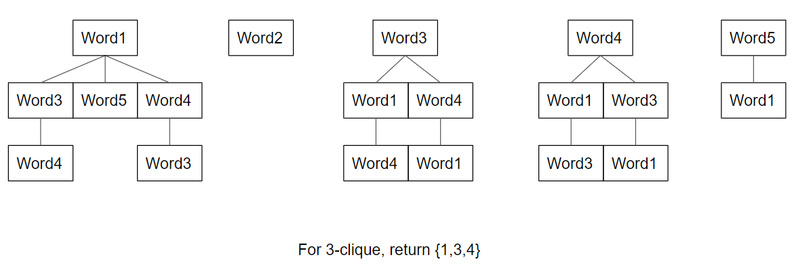

## Group Review
This program runs a Reverse Wordle game where the user thinks of a five letter word, and the program attempts to guess it in six guesses. For more specific information about the components of the program, see Instructions.md. The data structures used in this project are mainly graphs, arrays, hashsets, and arraylists.

The program is centered around the Guava MutableGraph data structure. We used this data structure so that we could efficiently hold information about the relationships among many pieces of data. The below image demonstrates how the structure was used:  You can also see the clique portion of the program (centered around the graph data structure) running in the following video:  Skip to 10:05 to see this portion of the program finish running.

Alternatively, we could have implemented the program using trees with several child nodes stored in HashSets (with LinkedLists to handle collision). The below image shows how this would have worked:   
