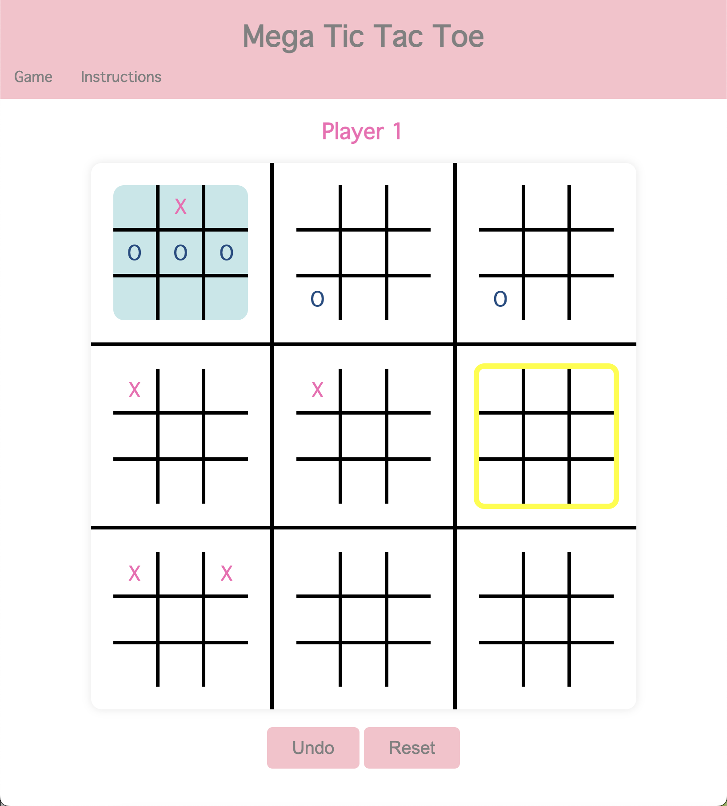

# Mega Tic Tac Toe

This project is a web-based implemenation of Mega Tic Tac Toe, a spin-off of the classic childhood game, Tic Tac Toe. In Mega Tic Tac Toe, each cell on the "mega board" contains a "mini-board," adding layers of strategy and complex to an otherwise fairly simply game. The placement of each player's move determins the location of the next player's move on the mega board. This project was built using JavaScript, HTML and CSS, showcasing a blend of frontend technologies to create a seamless user experience.

Technologies Used: JavaScript, HTML, CSS.
Description:
- Interactive Board: Updates according to user input and highlights where the next move must be played.
- User-Friendly Interface: Includes interactive popups, an undo button, a reset button and alerts.
- Comprehensive Pages: Contains a game page and an instruction page for easy navigation.
Skills Demonstrated: Web development, frontend development, game design, user experience.

Play the game [here](https://emruckle.github.io/ticTacToeGame/index.html).

## Example Gameplay

